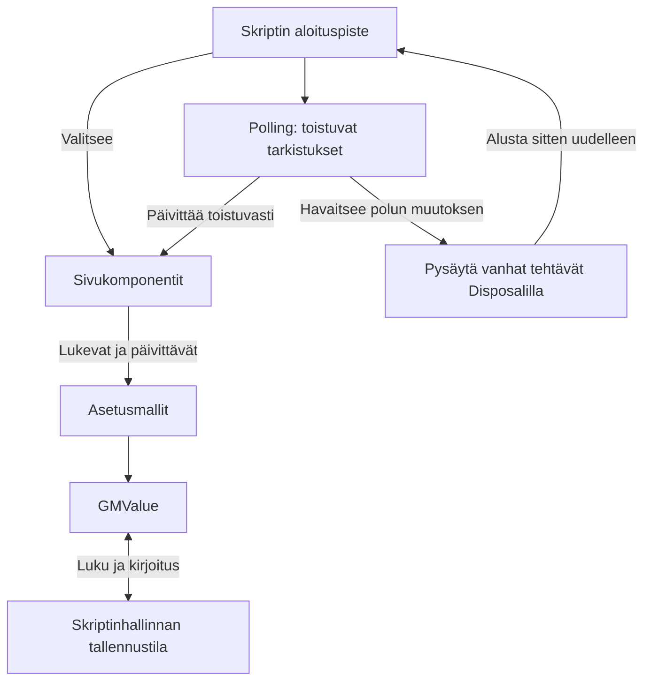

[English](README.md) | [Suomi](README.fi.md)

*Käännös on tehty GPT-5.6:n avustuksella.*

# feed-filter-script

Omaan käyttöön tarkoitettu Bilibili-sisällönsuodatusskripti. Piilottaa sisältöä julkaisijan ja videon keston perusteella sekä suodattaa osan etusivun mainos- ja kampanjasisällöstä.

## Ominaisuudet

- Estä julkaisijoita ja hallitse estettyjen käyttäjien luetteloa asetuspaneelissa.
- Aseta videoiden keston ala- ja yläraja suodattaaksesi liian lyhyet tai pitkät videot.
- Piilota etusivun mainoskortit kanavan perusteella tai piilota ne kaikki.
- Käsittele etusivua, hakutuloksia, käyttäjäsivuja, videosivuja ja suosituimpien videoiden listoja.
- Tallenna suodatusasetukset ja käytä niitä myös sisällön latautuessa dynaamisesti tai siirtyessäsi sivuston sisällä.

## Käyttö

1. Asenna selaimeen käyttäjäskriptien hallintalaajennus, joka tukee toimintoja `GM.getValue`, `GM.setValue` ja `GM.deleteValue`.
2. Tuo tämän repositorion `dist/block.user.js` hallintalaajennukseen ja ota skripti käyttöön.
3. Avaa Bilibili ja muokkaa suodatussääntöjä sivun estopainikkeiden ja asetusten kautta.

Tämä versio on tehty vanhempaa sivurakennetta varten, eikä sen yhteensopivuutta nykyisten Bilibili-sivujen kanssa ole varmistettu.

## Keskeiset tiedostot

| Tiedosto tai hakemisto | Tehtävä |
|---|---|
| `src/bilibili.com/block.user.ts` | Skriptin aloituspiste; valitsee nykyisen sivun komponentit ja alustaa ne uudelleen, kun sivuston sisäinen polku muuttuu |
| `src/bilibili.com/components/` | Eri sivujen suodatuslogiikka sekä estopainikkeet ja asetuspaneeli |
| `src/bilibili.com/models/` | Hallitsee estettyjä käyttäjiä, videoiden kestoasetuksia ja etusivun asetuksia sekä siirtää vanhat tallennetut tiedot uuteen muotoon |
| `src/utils/GMValue.ts` | Lukee ja kirjoittaa asetuksia skriptinhallinnan tallennustilaan ja päivittää paikallisen tilan säännöllisesti |
| `src/utils/Polling.ts`, `src/utils/Disposal.ts` | Tarkistavat sivua toistuvasti ja pysäyttävät vanhat tehtävät sivua vaihdettaessa |
| `scripts/build.ts` | Paketoi TypeScript-koodin asennettavaksi tiedostoksi ja lisää käyttäjäskriptin metatiedot sekä versionumeron |
| `dist/block.user.js` | Valmis skripti, jonka voi tuoda käyttäjäskriptien hallintaan |

## Koodin rakenne

Koodi jakautuu sivukomponentteihin, asetusmalleihin ja yhteisiin apuvälineisiin.

Aloituspiste valitsee nykyisellä sivulla tarvittavat komponentit. Komponentit lukevat asetusmalleja ja päättävät niiden perusteella, mitä sisältöä piilotetaan. Mallit tallentavat asetukset `GMValue`-luokan kautta. Toistuvat tarkistukset käsittelevät dynaamisesti latautuvaa sisältöä, ja siivoustoiminto pysäyttää vanhat tehtävät sivun vaihtuessa.



## Paikallinen koonti

Edellyttää Node.js:ää, pnpm 8:aa ja Gitiä.

```sh
git clone https://github.com/runjief/feed-filter-script.git
cd feed-filter-script
pnpm install --frozen-lockfile
pnpm run build
```

Valmis skripti tallennetaan tiedostoon `dist/block.user.js`.

Seuraa lähdekoodin muutoksia kehityksen aikana:

```sh
pnpm run dev
```

Tarkista TypeScript-tyypit:

```sh
pnpm exec tsc -p src/tsconfig.json
```
