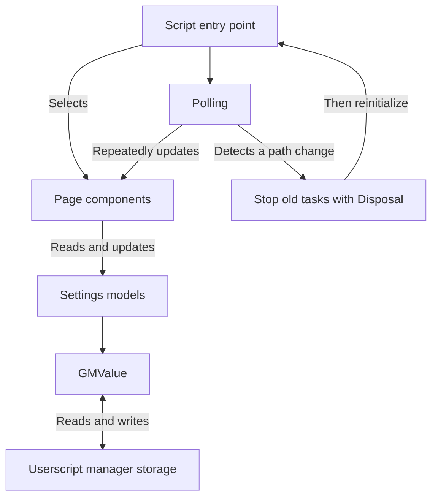

[English](README.md) | [Suomi](README.fi.md)

# feed-filter-script

A Bilibili content filtering userscript for personal use. Hide unwanted content by uploader and video duration, and filter some home page promotions and advertisements.

## Features

- Block uploaders and manage the blocked user list in the settings panel.
- Set a video duration range to filter out videos that are too short or too long.
- Hide home page promotional cards by channel, or hide them all.
- Handle home, search, user space, video detail, and ranking pages.
- Save filtering settings and keep applying them as content loads dynamically or you navigate within the site.

## Usage

1. Install a browser userscript manager that supports `GM.getValue`, `GM.setValue`, and `GM.deleteValue`.
2. Import `dist/block.user.js` from this repository and enable it.
3. Open Bilibili and adjust filtering rules using the block buttons and settings controls on the page.

This version targets an older page structure and has not been verified against the current Bilibili pages.

## Main files

| File or directory | Purpose |
|---|---|
| `src/bilibili.com/block.user.ts` | Script entry point; selects components for the current page and reinitializes when the path changes within the site |
| `src/bilibili.com/components/` | Filtering logic for different pages, plus block buttons and the settings panel |
| `src/bilibili.com/models/` | Manages blocked users, video duration and home page settings, and migrates older stored data |
| `src/utils/GMValue.ts` | Reads and writes settings in userscript manager storage and periodically refreshes local state |
| `src/utils/Polling.ts`, `src/utils/Disposal.ts` | Check the page repeatedly and stop old tasks when navigating to another page |
| `scripts/build.ts` | Bundles TypeScript into an installable file with userscript metadata and a version number |
| `dist/block.user.js` | Built script ready to import into a userscript manager |

## Code structure

The code is divided into page components, settings models, and shared utilities.

The entry point selects the components needed for the current page. Components read the settings models to decide which content to hide. The models persist settings through `GMValue`. Polling handles dynamically loaded content, while the cleanup utility stops old tasks after navigation.



## Local build

Requires Node.js, pnpm 8, and Git.

```sh
git clone https://github.com/runjief/feed-filter-script.git
cd feed-filter-script
pnpm install --frozen-lockfile
pnpm run build
```

The output file is `dist/block.user.js`.

Watch for source changes during development:

```sh
pnpm run dev
```

Check TypeScript types:

```sh
pnpm exec tsc -p src/tsconfig.json
```
